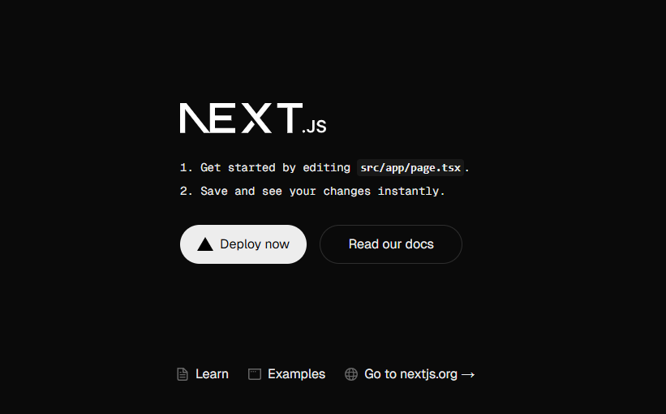

## Laporan Pratikum

|  | Pemrograman Berbasis Framework 2025 |
|--|--|
| NIM |2241720177|
| Nama |Amanda Fadila Erros|
| Kelas | TI - 3C |

### Jawaban Soal Pratikum 1

# Praktikum: Instalasi Git, VS Code, dan Node.js

## 1. Git
Git adalah sistem kontrol versi (Version Control System/VCS) terdistribusi yang digunakan untuk melacak perubahan dalam kode sumber selama pengembangan perangkat lunak. Dengan Git, pengembang dapat bekerja secara kolaboratif, mengelola versi kode, serta menyimpan riwayat perubahan dengan aman.

### Kegunaan Git dalam Praktikum:
- Menyimpan dan mengelola kode – Mencegah kehilangan data dan memungkinkan rollback ke versi sebelumnya.
- Melacak perubahan – Memudahkan melihat perkembangan proyek dan riwayat kode.
- Kolaborasi tim – Memungkinkan kerja kelompok tanpa bentrok kode.
- Evaluasi dosen – Dosen bisa menilai kontribusi mahasiswa berdasarkan riwayat commit.
- Menggunakan repositori online – GitHub/GitLab memudahkan berbagi kode dan akses dari mana saja.
- Integrasi teknologi lain – Bisa digunakan untuk otomatisasi pengujian dan deployment aplikasi.

### Perintah Dasar Git:
Berikut adalah beberapa perintah dasar Git yang sering digunakan:  

#### **1. Inisialisasi Repositori**  
- `git init` → Membuat repositori Git baru di folder lokal.  

#### **2. Mengelola Perubahan Kode**  
- `git add [file]` → Menambahkan file ke staging area.  
- `git commit -m "pesan"` → Menyimpan perubahan dengan pesan deskriptif.  
- `git status` → Melihat status perubahan dalam repositori.  
- `git log` → Melihat riwayat commit.  

#### **3. Bekerja dengan Repositori Jarak Jauh**  
- `git clone [url]` → Mengunduh repositori dari remote (GitHub, GitLab, dll.).  
- `git push` → Mengunggah perubahan ke repositori remote.  
- `git pull` → Mengambil perubahan terbaru dari remote.  

#### **4. Branching dan Merging**  
- `git branch [nama_cabang]` → Membuat cabang (branch) baru.  
- `git checkout [nama_cabang]` → Berpindah ke cabang tertentu.  
- `git merge [nama_cabang]` → Menggabungkan cabang ke branch aktif.  

#### **5. Mengembalikan Perubahan**  
- `git reset --hard [commit_id]` → Mengembalikan ke commit tertentu tanpa menyimpan perubahan.  
- `git revert [commit_id]` → Membuat commit baru yang membatalkan perubahan sebelumnya.  

---

## 2. VS Code (Visual Studio Code)
Visual Studio Code (VS Code) adalah teks editor gratis dan open-source yang dikembangkan oleh Microsoft. VS Code populer di kalangan pengembang karena ringan, cepat, dan mendukung banyak bahasa pemrograman seperti Python, JavaScript, Java, dan Flutter (Dart).

### Kegunaan VS Code dalam Praktikum: 
1. **Menulis dan Menjalankan Kode** – Memudahkan mahasiswa dalam menulis, mengedit, dan menjalankan program.  
2. **Mendukung Berbagai Bahasa Pemrograman** – Cocok untuk berbagai mata kuliah, dari pemrograman dasar hingga proyek akhir seperti **AgePlay**.  
3. **Integrasi dengan Git** – Memudahkan dalam menggunakan Git untuk manajemen versi kode.  
4. **Debugging** – Membantu mahasiswa menemukan dan memperbaiki kesalahan dalam kode.  
5. **Plugin dan Ekstensi** – Dapat menambahkan ekstensi seperti Flutter, Python, dan Jupyter Notebook sesuai kebutuhan.  
6. **Live Share** – Memungkinkan kolaborasi kode secara real-time dengan teman atau dosen.  
 


### Fitur Utama VS Code:
 
 **IntelliSense** – Auto-completion kode yang cerdas.  
 **Integrated Terminal** – Bisa menjalankan perintah langsung di dalam VS Code.  
 **Git Integration** – Mendukung manajemen versi dengan Git dan GitHub.  
 **Debugger Bawaan** – Untuk mendeteksi dan memperbaiki bug lebih mudah.  
 **Ekstensi dan Tema** – Bisa disesuaikan dengan kebutuhan coding. 

---

## 3. Node.js
Node.js adalah runtime JavaScript berbasis V8 (mesin JavaScript Google Chrome) yang memungkinkan eksekusi JavaScript di sisi server. Dengan Node.js, JavaScript tidak hanya berjalan di browser tetapi juga bisa digunakan untuk membangun aplikasi backend, API, dan server.

### Kegunaan Node.js dalam Praktikum:
1. **Membangun Server dan API** – Bisa digunakan untuk membuat server sederhana atau API RESTful.  
2. **Menjalankan JavaScript di Luar Browser** – Berguna untuk pemrosesan data, otomatisasi tugas, atau pengembangan backend.  
3. **Pengelolaan Paket dengan NPM** – Menggunakan **Node Package Manager (NPM)** untuk menginstal pustaka tambahan.  
4. **Realtime Processing** – Cocok untuk aplikasi seperti chat dan notifikasi live.  
5. **Kolaborasi dengan Framework** – Digunakan bersama dengan framework seperti 

### Perintah Dasar Node.js:

### **1. Mengecek Versi Node.js dan NPM**  
- `node -v` → Menampilkan versi Node.js yang terinstal.  
- `npm -v` → Menampilkan versi NPM (Node Package Manager).  

### **2. Menjalankan File JavaScript dengan Node.js**  
- `node [nama_file].js` → Menjalankan file JavaScript di Node.js.  
  ```sh
  node server.js
  ```

### **3. Menggunakan REPL (Read-Eval-Print Loop) Node.js**  
- `node` → Masuk ke mode REPL (console interaktif Node.js).  
- Ketik kode JavaScript langsung di terminal dan tekan **Enter**.  
  ```sh
  node
  > console.log("Hello, Node.js!");
  ```

### **4. Mengelola Paket dengan NPM**  
- `npm init -y` → Membuat file **package.json** untuk proyek Node.js.  
- `npm install [nama_paket]` → Menginstal paket dari NPM.  
  ```sh
  npm install express
  ```
- `npm uninstall [nama_paket]` → Menghapus paket tertentu.  
- `npm list` → Melihat daftar paket yang sudah diinstal.  

### **5. Membuat dan Menjalankan Server Sederhana**  
- Gunakan kode berikut untuk membuat server dengan Node.js:  
  ```javascript
  const http = require('http');
  const server = http.createServer((req, res) => {
      res.writeHead(200, { 'Content-Type': 'text/plain' });
      res.end('Server berjalan di Node.js!');
  });
  server.listen(3000, () => {
      console.log('Server berjalan di http://localhost:3000');
  });
  ```
- Jalankan dengan perintah:  
  ```sh
  node server.js
  ```

### **6. Menggunakan Modul Node.js**  
- Import dan gunakan modul internal:  
  ```javascript
  const fs = require('fs'); // Modul untuk bekerja dengan file
  fs.writeFileSync('test.txt', 'Hello, Node.js!');
  ```
- Jalankan dengan:  
  ```sh
  node script.js
  ```

### Screenshoot Tools Terinstall
1. Git


2. Visual Studio Code


3. Node JS


---


### Jawaban Soal Pratikum 2
### 1. Jelaskan tentang **TypeScript, ESLint, Tailwind CSS, App Router, Import Alias, dan Turbopack**:  

#### **1. TypeScript**  
TypeScript adalah **bahasa pemrograman berbasis JavaScript** yang menambahkan fitur **tipe statis (static typing)**. Ini membantu dalam mendeteksi error lebih awal dan meningkatkan kualitas kode.  
 Contoh kode TypeScript:  
```typescript
function greet(name: string): string {
  return `Hello, ${name}!`;
}
```

#### **2. ESLint**  
ESLint adalah alat untuk **menganalisis kode JavaScript/TypeScript dan menemukan kesalahan atau gaya penulisan yang tidak konsisten**. Ini berguna untuk menjaga kualitas kode dalam tim.  
 Contoh konfigurasi `.eslintrc.json`:  
```json
{
  "extends": "eslint:recommended",
  "rules": {
    "no-unused-vars": "warn"
  }
}
```

#### **3. Tailwind CSS**  
Tailwind CSS adalah **framework CSS berbasis utility-first** yang memungkinkan penulisan gaya langsung di dalam HTML tanpa perlu membuat file CSS khusus.  
 Contoh penggunaan Tailwind CSS:  
```html
<button class="bg-blue-500 text-white px-4 py-2 rounded">Klik Saya</button>
```

#### **4. App Router (Next.js 13+)**  
App Router adalah **metode routing terbaru di Next.js 13+** yang menggunakan folder `app/` sebagai dasar pembentukan halaman. Ini memungkinkan **server-side rendering (SSR), streaming, dan layout yang lebih fleksibel**.  
 Contoh routing di `app/page.tsx`:  
```tsx
export default function Home() {
  return <h1>Halo, Next.js dengan App Router!</h1>;
}
```

#### **5. Import Alias**  
Import alias memungkinkan **penggunaan jalur impor yang lebih pendek** untuk menghindari penulisan path yang panjang dalam proyek.  
 Contoh di `tsconfig.json`:  
```json
{
  "compilerOptions": {
    "paths": {
      "@components/*": ["src/components/*"]
    }
  }
}
```
 Cara menggunakannya dalam kode:  
```tsx
import Button from "@components/Button";
```

#### **6. Turbopack**  
Turbopack adalah **bundler baru untuk Next.js yang lebih cepat dari Webpack**. Ini digunakan untuk **mempercepat proses build dan hot module replacement (HMR)** dalam pengembangan.  

### 2. Penjelasan Folder

Berdasarkan gambar struktur proyek di **VS Code**, berikut penjelasan singkat dari setiap folder dan file:  

### **📂 Folder Utama**  
1. **`hello-world/`** → Folder utama proyek, kemungkinan proyek Next.js.  
2. **`node_modules/`** → Berisi semua dependensi/paket dari **NPM** yang diinstal. **Jangan diubah langsung!**  
3. **`public/`** → Folder untuk file statis seperti gambar, ikon, atau font yang bisa diakses oleh pengguna.  
4. **`src/app/`** → Folder utama untuk routing **Next.js 13+ (App Router)**.  

### **📂 Folder `src/app/`**  
- **`favicon.ico`** → Ikon kecil yang muncul di tab browser.  
- **`globals.css`** → File CSS global yang digunakan di seluruh aplikasi.  
- **`layout.tsx`** → Komponen tata letak utama (biasa digunakan untuk header, footer, dll.).  
- **`page.tsx`** → Halaman utama aplikasi, yang di-render ketika pengguna mengakses `/`.  

### **📄 File Konfigurasi**  
- **`.gitignore`** → File untuk menentukan file/folder yang tidak perlu dimasukkan ke dalam Git.  
- **`eslint.config.mjs`** → Konfigurasi untuk ESLint (analisis kode JavaScript/TypeScript).  
- **`next-env.d.ts`** → File deklarasi TypeScript untuk proyek Next.js.  
- **`next.config.ts`** → Konfigurasi Next.js (misalnya pengaturan domain gambar).  
- **`package.json`** → File utama yang menyimpan daftar dependensi proyek, script, dan metadata lainnya.  
- **`package-lock.json`** → Mengunci versi dependensi yang digunakan di proyek.  
- **`postcss.config.mjs`** → Konfigurasi untuk PostCSS (biasanya digunakan bersama Tailwind CSS).  
- **`README.md`** → Dokumentasi proyek (bisa berisi deskripsi, cara menjalankan proyek, dll.).  
- **`tailwind.config.ts`** → Konfigurasi untuk **Tailwind CSS**.  
- **`tsconfig.json`** → Konfigurasi untuk **TypeScript** (misalnya pengaturan alias import, strict mode, dll.).  


### 3. Screenshoot Tahapan Percobaan

1. 

2. 

3. 
### Jawaban Soal Pratikum 3
1. 

2. 

3. 

---
### Jawaban Soal Pratikum 4
1. Penjelasan Sintaks `user.imageUrl`

Sintaks `user.imageUrl` digunakan untuk mengakses URL gambar yang terkait dengan objek user, misalnya gambar profil

2. Screenshoot

- 

- 

- 
